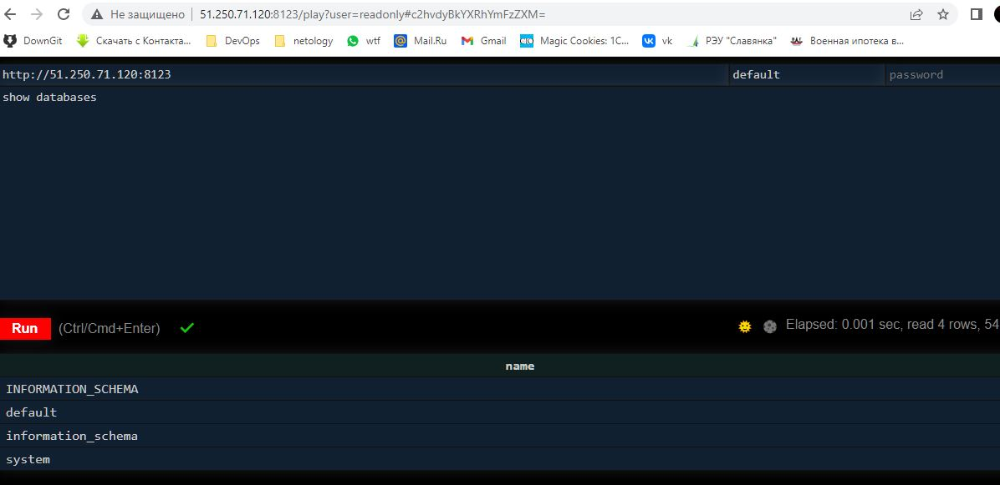
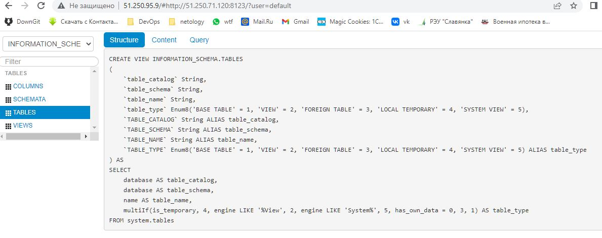

**ветка MNT-13**

# Домашнее задание к занятию "8.3 Работа с Roles"

Ответ можно искать по **Ответ:**

Запуск производился в 'prod' среде, развернутой на YC. Т.е. три виртуальных сервера, по одной роли на сервер. Исключение - lighthouse+nginx

```yaml
---
clickhouse:
  hosts:
    clickhouse-01:
      ansible_host: 51.250.71.120
vector:
  hosts:
    vector-01:
      ansible_host: 51.250.92.207
lighthouse:
  hosts:
    lighthouse-01:
      ansible_host: 51.250.95.9
```

## Подготовка к выполнению

----

1. *Создайте два пустых публичных репозитория в любом своём проекте: vector-role и lighthouse-role.*

+

----

2. *Добавьте публичную часть своего ключа к своему профилю в github.*

+

----

## Основная часть

*Наша основная цель - разбить наш playbook на отдельные roles. Задача: сделать roles для clickhouse, vector и lighthouse и написать playbook для использования этих ролей. Ожидаемый результат: существуют три ваших репозитория: два с roles и один с playbook.*

1. *Создать в старой версии playbook файл `requirements.yml` и заполнить его следующим содержимым:*

```yaml
---
  - src: git@github.com:AlexeySetevoi/ansible-clickhouse.git
    scm: git
    version: "1.12.1"
    name: clickhouse
```

+

----

2. *При помощи `ansible-galaxy` скачать себе эту роль.*

```bash
ansible-galaxy -r requirements.yml -p roles
```

+

----

3. *Создать новый каталог с ролью при помощи `ansible-galaxy role init vector-role`.*

+

---

4. *На основе tasks из старого playbook заполните новую role. Разнесите переменные между `vars` и `default`.*

+

----

5. *Перенести нужные шаблоны конфигов в `templates`.*

Помечу: конфиги ``clickhouse`` для доступа извне и настройки пользователей правил наживую. Однако позже были найдены `templates` в самой роли, в частности `config.j2` 

----
6. *Описать в `README.md` обе роли и их параметры.*

+

----
7. *Повторите шаги 3-6 для lighthouse. Помните, что одна роль должна настраивать один продукт.*

+

----
8. *Выложите все roles в репозитории. Проставьте тэги, используя семантическую нумерацию Добавьте roles в `requirements.yml` в playbook.*

```yaml
---
  - src: git@github.com:AlexeySetevoi/ansible-clickhouse.git
    scm: git
    version: "1.12.1"
    name: clickhouse

  - src: git@github.com:bolgovsky/vector-role.git
    scm: git
    version: "1.0.1"
    name: vector-role

  - src: git@github.com:bolgovsky/lighthouse-role.git
    scm: git
    version: "1.0.1"
    name: lighthouse-role
```

+

----

9. *Переработайте playbook на использование roles. Не забудьте про зависимости lighthouse и возможности совмещения `roles` с `tasks`.*

+

----

10. *Выложите playbook в репозиторий.*

+

----

11. *В ответ приведите ссылки на оба репозитория с roles и одну ссылку на репозиторий с playbook.*

**Ответ:**

- **Репозиторий [vector-role](https://github.com/bolgovsky/vector-role)**
- **Репозиторий [lighthouse-role](https://github.com/bolgovsky/lighthouse-role)**
- **Репозиторий [Playbook](https://github.com/bolgovsky/ansible-roles)**

Пример вывода установки ролей:
```bash 
denis@DenisPC:~/08-ansible-03-roles/roles/vector-role$
denis@DenisPC:~/08-ansible-03-roles$ ansible-galaxy install -r requirements.yml -p roles --force
- changing role clickhouse from 1.11.0 to 1.12.1
Enter passphrase for key '/home/denis/.ssh/id_rsa':
- extracting clickhouse to /home/denis/08-ansible-03-roles/roles/clickhouse
- clickhouse (1.12.1) was installed successfully
- changing role vector-role from 1.0.0 to 1.0.1
Enter passphrase for key '/home/denis/.ssh/id_rsa':
- extracting vector-role to /home/denis/08-ansible-03-roles/roles/vector-role
- vector-role (1.0.1) was installed successfully
- changing role lighthouse-role from 1.0.1 to 1.0.1
Enter passphrase for key '/home/denis/.ssh/id_rsa':
- extracting lighthouse-role to /home/denis/08-ansible-03-roles/roles/lighthouse-role
- lighthouse-role (1.0.1) was installed successfully
```

Пример вывода деплоя ролей на виртуальные сервера:
```bash
 denis@DenisPC:~/08-ansible-03-roles$ ansible-playbook -i inventory/prod.yml site.yml
PLAY [Install Clickhouse] *******************************************************************************************************************************************************
TASK [Gathering Facts] **********************************************************************************************************************************************************Enter passphrase for key '/home/denis/.ssh/id_rsa':
ok: [clickhouse-02]
TASK [clickhouse : Include OS Family Specific Variables] ************************************************************************************************************************ok: [clickhouse-02]
TASK [clickhouse : include_tasks] ***********************************************************************************************************************************************included: /home/denis/08-ansible-03-roles/roles/clickhouse/tasks/precheck.yml for clickhouse-02
TASK [clickhouse : Requirements check | Checking sse4_2 support] ****************************************************************************************************************ok: [clickhouse-02]
TASK [clickhouse : Requirements check | Not supported distribution && release] **************************************************************************************************skipping: [clickhouse-02]
TASK [clickhouse : include_tasks] ***********************************************************************************************************************************************included: /home/denis/08-ansible-03-roles/roles/clickhouse/tasks/params.yml for clickhouse-02
TASK [Set clickhouse_service_enable] ********************************************************************************************************************************************ok: [clickhouse-02]
TASK [Set clickhouse_service_ensure] ********************************************************************************************************************************************ok: [clickhouse-02]
TASK [clickhouse : include_tasks] ***********************************************************************************************************************************************included: /home/denis/08-ansible-03-roles/roles/clickhouse/tasks/install/apt.yml for clickhouse-02
TASK [clickhouse : Install by APT | Apt-key add repo key] ***********************************************************************************************************************ok: [clickhouse-02]
TASK [clickhouse : Install by APT | Remove old repo] ****************************************************************************************************************************ok: [clickhouse-02]
TASK [clickhouse : Install by APT | Repo installation] **************************************************************************************************************************ok: [clickhouse-02]
TASK [clickhouse : Install by APT | Package installation] ***********************************************************************************************************************ok: [clickhouse-02]
TASK [clickhouse : Install by APT | Package installation] ***********************************************************************************************************************skipping: [clickhouse-02]
TASK [clickhouse : Hold specified version during APT upgrade | Package installation] ********************************************************************************************ok: [clickhouse-02] => (item=clickhouse-client)
ok: [clickhouse-02] => (item=clickhouse-server)
ok: [clickhouse-02] => (item=clickhouse-common-static)
TASK [clickhouse : include_tasks] ***********************************************************************************************************************************************included: /home/denis/08-ansible-03-roles/roles/clickhouse/tasks/configure/sys.yml for clickhouse-02
TASK [Check clickhouse config, data and logs] ***********************************************************************************************************************************ok: [clickhouse-02] => (item=/var/log/clickhouse-server)
ok: [clickhouse-02] => (item=/etc/clickhouse-server)
ok: [clickhouse-02] => (item=/var/lib/clickhouse/tmp/)
ok: [clickhouse-02] => (item=/var/lib/clickhouse/)
TASK [clickhouse : Config | Create config.d folder] *****************************************************************************************************************************ok: [clickhouse-02]
TASK [clickhouse : Config | Create users.d folder] ******************************************************************************************************************************ok: [clickhouse-02]
TASK [clickhouse : Config | Generate system config] *****************************************************************************************************************************ok: [clickhouse-02]
TASK [clickhouse : Config | Generate users config] ******************************************************************************************************************************ok: [clickhouse-02]
TASK [clickhouse : Config | Generate remote_servers config] *********************************************************************************************************************skipping: [clickhouse-02]
TASK [clickhouse : Config | Generate macros config] *****************************************************************************************************************************skipping: [clickhouse-02]
TASK [clickhouse : Config | Generate zookeeper servers config] ******************************************************************************************************************skipping: [clickhouse-02]
TASK [clickhouse : Config | Fix interserver_http_port and intersever_https_port collision] **************************************************************************************skipping: [clickhouse-02]
TASK [clickhouse : include_tasks] ***********************************************************************************************************************************************included: /home/denis/08-ansible-03-roles/roles/clickhouse/tasks/service.yml for clickhouse-02
TASK [Ensure clickhouse-server.service is enabled: True and state: started] *****************************************************************************************************ok: [clickhouse-02]
TASK [clickhouse : Wait for Clickhouse Server to Become Ready] ******************************************************************************************************************ok: [clickhouse-02]
TASK [clickhouse : include_tasks] ***********************************************************************************************************************************************included: /home/denis/08-ansible-03-roles/roles/clickhouse/tasks/configure/db.yml for clickhouse-02
TASK [clickhouse : Set ClickHose Connection String] *****************************************************************************************************************************ok: [clickhouse-02]
TASK [clickhouse : Gather list of existing databases] ***************************************************************************************************************************ok: [clickhouse-02]
TASK [clickhouse : Config | Delete database config] *****************************************************************************************************************************
TASK [clickhouse : Config | Create database config] *****************************************************************************************************************************
TASK [clickhouse : include_tasks] ***********************************************************************************************************************************************included: /home/denis/08-ansible-03-roles/roles/clickhouse/tasks/configure/dict.yml for clickhouse-02
TASK [clickhouse : Config | Generate dictionary config] *************************************************************************************************************************skipping: [clickhouse-02]
skipping: [clickhouse-02]
PLAY [Install Vector] ***********************************************************************************************************************************************************
TASK [Gathering Facts] **********************************************************************************************************************************************************Enter passphrase for key '/home/denis/.ssh/id_rsa':
ok: [vector-01]
TASK [vector-role : Get vector distrib] *****************************************************************************************************************************************ok: [vector-01] => (item=vector)
TASK [vector-role : Install vector packages] ************************************************************************************************************************************changed: [vector-01] => (item=vector)
RUNNING HANDLER [vector-role : Start vector service] ****************************************************************************************************************************changed: [vector-01]
PLAY [Install lighthouse] *******************************************************************************************************************************************************
TASK [Gathering Facts] **********************************************************************************************************************************************************The authenticity of host '51.250.95.9 (51.250.95.9)' can't be established.
ECDSA key fingerprint is SHA256:B2cQopVdm4DzfZ0iIkR+GKnkKYWAcTgb2ZFAy5dCDnA.
Are you sure you want to continue connecting (yes/no)? 
Please type 'yes' or 'no': yes
Enter passphrase for key '/home/denis/.ssh/id_rsa':
ok: [lighthouse-01]
TASK [add repo] *****************************************************************************************************************************************************************changed: [lighthouse-01]
TASK [Install nginx] ************************************************************************************************************************************************************changed: [lighthouse-01]
TASK [Create nginx config] ******************************************************************************************************************************************************changed: [lighthouse-01]
RUNNING HANDLER [Start nginx service] *******************************************************************************************************************************************changed: [lighthouse-01]
TASK [lighthouse-role : Check git present] **************************************************************************************************************************************changed: [lighthouse-01]
TASK [lighthouse-role : Clone lighthouse] ***************************************************************************************************************************************changed: [lighthouse-01]
PLAY RECAP **********************************************************************************************************************************************************************clickhouse-02              : ok=26   changed=0    unreachable=0    failed=0    skipped=10   rescued=0    ignored=0
lighthouse-01              : ok=7    changed=6    unreachable=0    failed=0    skipped=0    rescued=0    ignored=0
vector-01                  : ok=4    changed=2    unreachable=0    failed=0    skipped=0    rescued=0    ignored=0
```

На выходе имеем:
* работающий clickhouse 
* работающий lighthouse 
* vector не настраивал